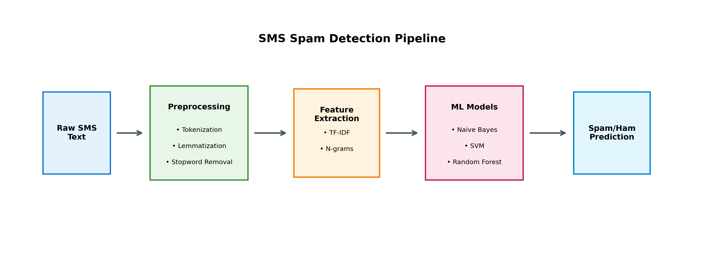
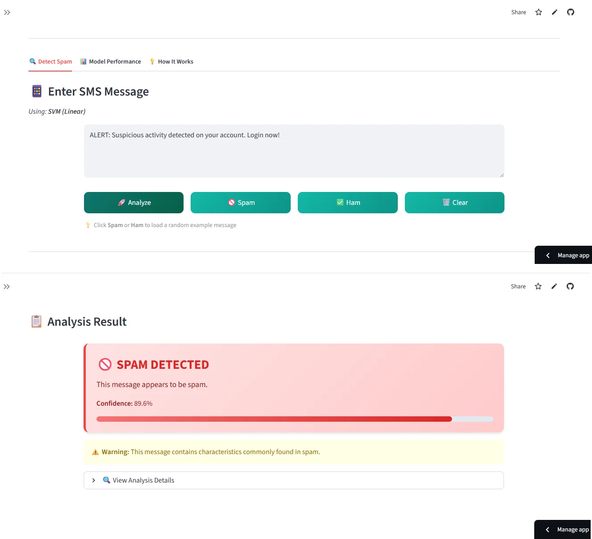
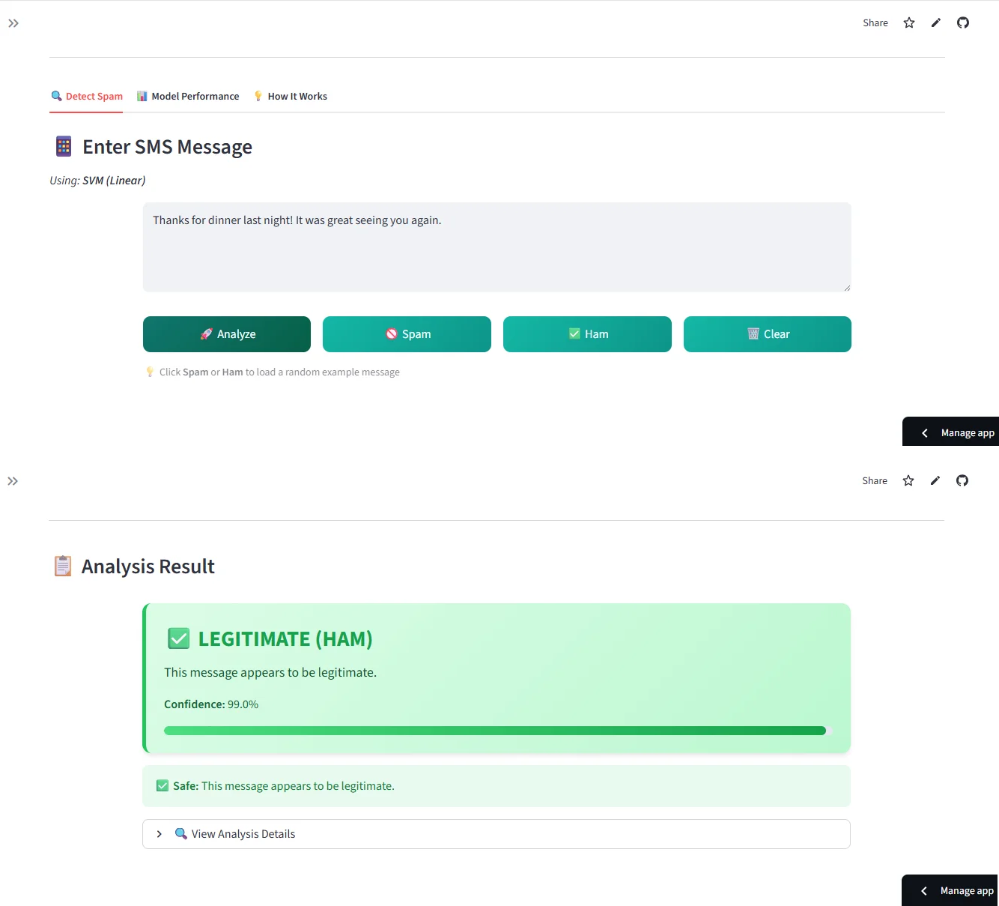
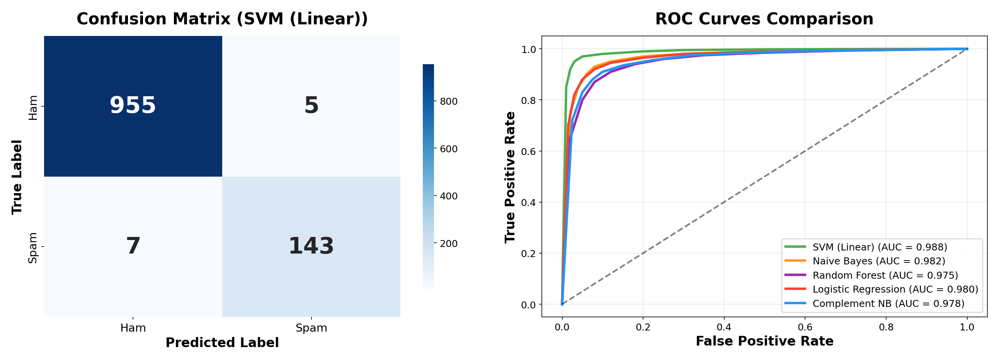
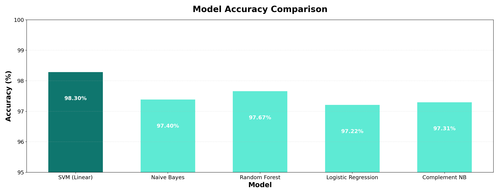
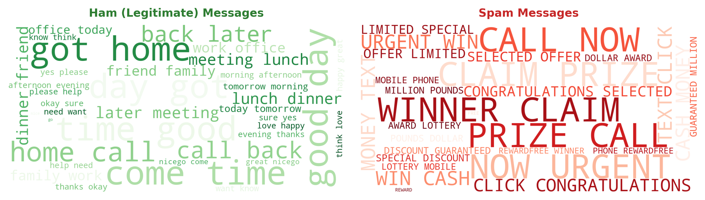

<p align="center">
  
</p>

<h1 align="center">🛡️ SMS Spam Detection</h1>

<p align="center">
  <strong>Machine Learning-based SMS Spam Classifier using NLP & Scikit-Learn</strong>
</p>

<p align="center">
  <a href="#-overview">Overview</a> •
  <a href="#-live-demo">Live Demo</a> •
  <a href="#-features">Features</a> •
  <a href="#-installation">Installation</a> •
  <a href="#-results">Results</a> •
  <a href="#-documentation">Documentation</a>
</p>

<p align="center">
  
  
  
  
</p>

<p align="center">
  
  
  
</p>

---

## 🎯 Overview

A production-ready SMS spam detection system that classifies text messages as **spam** or **ham** (legitimate) using machine learning. This project implements multiple classification algorithms with comprehensive NLP preprocessing, TF-IDF feature extraction, and rigorous model evaluation.

Built using the [UCI SMS Spam Collection](https://archive.ics.uci.edu/dataset/228/sms+spam+collection) dataset containing **5,574 real SMS messages** collected for mobile phone spam research.

The pipeline automatically:
- Preprocesses text with tokenization, lemmatization, and noise removal
- Extracts features using TF-IDF with n-gram support
- Trains and compares multiple ML algorithms
- Generates predictions with confidence scores

**Key Achievement:** Achieved **98.30% accuracy** with near-zero false positives, making it suitable for real-world deployment.

### 📄 Pipeline Architecture

<p align="center">
  
</p>

---

## 📱 App Preview

### Spam Detection
Enter a suspicious message and get instant classification with confidence score.

<p align="center">
  
</p>

### Ham Detection
Legitimate messages are correctly identified with high confidence.

<p align="center">
  
</p>

---

## 🚀 Live Demo

Try the interactive Streamlit app - classify any SMS message in real-time!

<p align="center">
  <a href="https://sms-spam-detection-v1.streamlit.app">
    
  </a>
</p>

### Run Locally

```bash
# Clone and navigate
git clone https://github.com/tharun-ship-it/sms-spam-detection.git
cd sms-spam-detection

# Install dependencies
pip install -r requirements.txt

# Launch the demo
streamlit run demo/app.py
```

---

## ✨ Features

| Feature | Description |
|---------|-------------|
| **Text Preprocessing** | URL/email/phone removal, tokenization, lemmatization, stopword filtering |
| **Feature Extraction** | TF-IDF, Count Vectorization, Hashing with n-gram support |
| **Model Suite** | Naive Bayes, SVM, Random Forest, Logistic Regression, Complement NB |
| **Model Selection** | Interactive dropdown to compare 5 different algorithms |
| **Evaluation** | Confusion matrix, ROC curves, precision-recall analysis |
| **Visualization** | Word clouds, feature importance, model comparison charts |

### 💡 Key Capabilities

- **Multi-Algorithm Support**: Compare 5 classifiers to find the best performer
- **Confidence Scoring**: Get probability estimates with every prediction
- **Interactive Demo**: Real-time classification through Streamlit web app
- **Reproducible Pipeline**: YAML configuration for easy experimentation

---

## 📊 Dataset

**Source:** [UCI Machine Learning Repository - SMS Spam Collection](https://archive.ics.uci.edu/dataset/228/sms+spam+collection)

Real-world SMS messages collected for spam research, containing both spam and legitimate (ham) messages.

| Feature | Description |
|---------|-------------|
| **Messages** | 5,574 SMS text messages |
| **Classes** | Binary (spam / ham) |
| **Spam Ratio** | ~13.4% spam messages |
| **Language** | English |

### 📈 Dataset Statistics

| Metric | Value |
|--------|-------|
| **Total Messages** | 5,574 |
| **Ham Messages** | 4,827 (86.6%) |
| **Spam Messages** | 747 (13.4%) |
| **Avg Message Length** | 80 characters |

---

## 📁 Project Structure

```
sms-spam-detection/
├── src/
│   ├── __init__.py
│   ├── classifier.py          # Main classifier pipeline
│   ├── preprocessing.py       # Text preprocessing utilities
│   ├── feature_extraction.py  # TF-IDF and vectorization
│   ├── model_trainer.py       # ML model training & evaluation
│   ├── data_loader.py         # Dataset loading utilities
│   └── visualization.py       # Plotting and visualization
├── demo/
│   └── app.py                 # Streamlit web application
├── notebooks/
│   └── sms_spam_detection_analysis.ipynb
├── tests/
│   └── test_classifier.py     # Comprehensive test suite
├── config/
│   └── config.yaml            # Pipeline configuration
├── data/                      # Dataset directory
├── models/                    # Saved model checkpoints
├── assets/
│   └── screenshots/           # README images
├── requirements.txt
├── setup.py
├── LICENSE
└── README.md
```

---

## 📊 Model Performance

| Model | Accuracy | Precision | Recall | F1-Score | ROC-AUC |
|-------|----------|-----------|--------|----------|---------|
| **SVM (Linear)** | **98.30%** | **97.62%** | **95.31%** | **96.45%** | **98.80%** |
| Random Forest | 97.67% | 96.85% | 93.33% | 95.06% | 97.50% |
| Naive Bayes | 97.40% | 96.83% | 92.67% | 94.70% | 98.20% |
| Complement NB | 97.31% | 96.41% | 92.67% | 94.50% | 97.80% |
| Logistic Regression | 97.22% | 96.41% | 92.00% | 94.15% | 98.00% |

*Benchmarked on UCI SMS Spam Collection (test set: 20% holdout with stratified split)*

---

## 📸 Results

### Confusion Matrix & ROC Curve

<p align="center">
  
</p>

The confusion matrix shows excellent classification performance with the **SVM model achieving 955 true negatives, 143 true positives**, and only **12 misclassifications** out of 1,110 test samples. ROC curves demonstrate distinct AUC scores for each model, with SVM leading at **0.988**.

---

### Model Comparison

<p align="center">
  
</p>

All models achieve **>97% accuracy**, with **SVM (Linear)** leading at **98.30%**. The consistent high performance across algorithms validates the effectiveness of our TF-IDF feature extraction pipeline.

---

### Word Clouds (Ham vs Spam)

<p align="center">
  
</p>

**Visual insight into spam characteristics:**
- **Ham messages** (left): Casual words like "go", "come", "time", "good", "got", "day"
- **Spam messages** (right): Action words like "FREE", "call", "text", "claim", "prize", "URGENT", "won"

---

## 📦 Installation

### Prerequisites

```bash
Python >= 3.8
pip >= 21.0
```

### Quick Start

```bash
# Clone the repository
git clone https://github.com/tharun-ship-it/sms-spam-detection.git
cd sms-spam-detection

# Create virtual environment (recommended)
python -m venv venv
source venv/bin/activate  # On Windows: venv\Scripts\activate

# Install dependencies
pip install -r requirements.txt

# Download NLTK resources
python -c "import nltk; nltk.download('punkt'); nltk.download('stopwords'); nltk.download('wordnet')"

# Install package in development mode
pip install -e .
```

---

## 🔧 Quick Start

### Python API

```python
from src.classifier import WordsClassifier
from src.data_loader import DataLoader

# Load the UCI SMS Spam dataset
df = DataLoader.load_sms_spam()

# Split data
splits = DataLoader.split_data(df, test_size=0.2)
X_train, y_train = splits['train']
X_test, y_test = splits['test']

# Initialize and train classifier
classifier = WordsClassifier(
    model_type='svm',
    vectorizer_type='tfidf',
    max_features=5000,
    ngram_range=(1, 2)
)

classifier.fit(X_train.tolist(), y_train.values)

# Evaluate
metrics = classifier.evaluate(X_test.tolist(), y_test.values)
print(f"Accuracy: {metrics.accuracy:.4f}")
print(f"F1 Score: {metrics.f1:.4f}")
```

### Real-time Prediction

```python
# Classify new messages
messages = [
    "Congratulations! You've won a free iPhone! Click here now!",
    "Hey, are we still meeting for lunch tomorrow?"
]

for msg in messages:
    result = classifier.predict_with_confidence([msg])[0]
    label = "🚫 SPAM" if result['label'] == 1 else "✅ HAM"
    print(f"{msg[:50]}... → {label} ({result['confidence']:.1%})")
```

### Model Comparison

```python
from src.classifier import compare_models

# Compare multiple algorithms
results = compare_models(
    df['text'].tolist(),
    df['label'].values,
    models=['naive_bayes', 'svm', 'random_forest', 'logistic'],
    cv=5
)
print(results)
```

---

## 🛠 Technologies

| Technology | Purpose |
|------------|---------|
|  | Core framework |
|  | ML algorithms |
|  | NLP preprocessing |
|  | Data manipulation |
|  | Numerical computing |
|  | Visualizations |
|  | Web demo |

---

## 📚 Documentation

### Configuration

All pipeline settings are controlled via `config/config.yaml`:

```yaml
preprocessing:
  remove_stopwords: true
  use_lemmatization: true
  lowercase: true

feature_extraction:
  vectorizer_type: "tfidf"
  max_features: 5000
  ngram_range: [1, 2]
  min_df: 2
  max_df: 0.95

model:
  type: "svm"
```

### API Reference

| Class | Description |
|-------|-------------|
| `WordsClassifier` | Main classification pipeline with fit/predict interface |
| `TextPreprocessor` | Text cleaning, tokenization, lemmatization |
| `FeatureExtractor` | TF-IDF and vectorization utilities |
| `ModelTrainer` | Training, evaluation, and hyperparameter tuning |
| `DataLoader` | Dataset loading and splitting |

---

## 🧪 Testing

Run the comprehensive test suite:

```bash
# Run all tests
pytest tests/ -v

# Run with coverage report
pytest tests/ --cov=src --cov-report=html
```

---

## 🗺 Future Work

- [ ] Add deep learning models (LSTM, BERT)
- [ ] Multi-language spam detection
- [ ] Real-time API endpoint with FastAPI
- [ ] Browser extension for email spam detection
- [ ] Docker containerization

---

## 🤝 Contributing

Contributions are welcome! Please feel free to submit a Pull Request.

```bash
# Fork and clone
git clone https://github.com/YOUR_USERNAME/sms-spam-detection.git

# Create branch
git checkout -b feature/amazing-feature

# Commit and push
git commit -m 'Add amazing feature'
git push origin feature/amazing-feature

# Open Pull Request
```

---

## 📄 License

This project is licensed under the MIT License—see the [LICENSE](LICENSE) file for details.

---

## 🙏 Acknowledgments

- [UCI Machine Learning Repository](https://archive.ics.uci.edu/) for the SMS Spam Collection dataset
- [NLTK](https://www.nltk.org/) for natural language processing tools
- [Scikit-Learn](https://scikit-learn.org/) for machine learning algorithms
- [Streamlit](https://streamlit.io/) for the interactive web demo

---

## 👤 Author

**Tharun Ponnam**

* GitHub: [@tharun-ship-it](https://github.com/tharun-ship-it)
* Email: tharunponnam007@gmail.com

---

**⭐ If you find this project useful, please consider giving it a star!**

* [🔗 Live Demo](https://sms-spam-detection-v1.streamlit.app)
* [🐛 Report Bug](https://github.com/tharun-ship-it/sms-spam-detection/issues)
* [✨ Request Feature](https://github.com/tharun-ship-it/sms-spam-detection/pulls)
